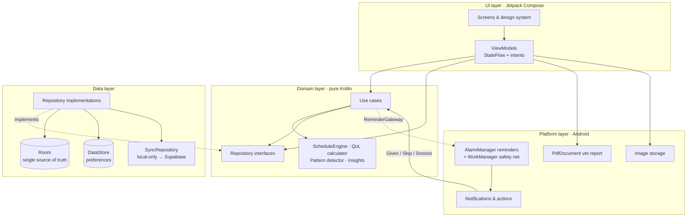
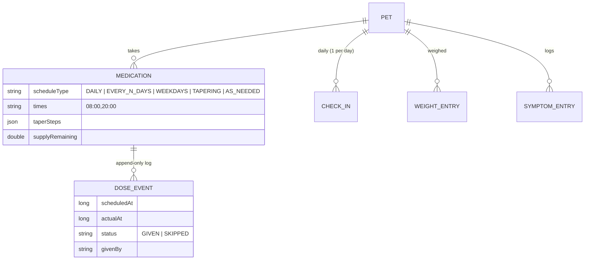

<div align="center">

# 🐾 GoldenPaw

### Senior pet care companion for Android

*Every good day, remembered. Every hard day, easier.*


</div>

---

GoldenPaw helps owners of **aging and chronically ill dogs and cats** handle the daily work of care: complex medication schedules, mobility and pain tracking, a recognised quality-of-life score, a symptom journal and a **one-tap, vet-ready PDF report**.

General-purpose pet apps cover vaccines and appointments. GoldenPaw is built for the slower, harder job of looking after a senior pet. It uses a calm, respectful tone, needs about ten seconds per interaction, and never makes you feel guilty about a missed day.

## Contents

- [Features](#-features)
- [Architecture](#-architecture)
- [Tech stack](#-tech-stack)
- [Project structure](#-project-structure)
- [Getting started](#-getting-started)
- [Design principles](#-design-principles)
- [Roadmap](#-roadmap)
- [Disclaimer](#-disclaimer)

---

## ✨ Features

### 💊 Medication manager
- Flexible schedules: **daily**, **every N days**, **specific weekdays**, **tapering** (dated dose steps) and **as needed**
- Multiple times per day with presets (1–4×), a *with food* flag, route, reason and prescriber
- **One-tap "Given"** with haptic feedback, **Skip**, **Undo** (within 10 minutes) and missed-dose detection with a "give late" option
- **Refill countdown** based on the remaining supply, plus refill alerts
- Live preview of upcoming doses while you edit

### 🔔 Reliable reminders
- Exact alarms (`setExactAndAllowWhileIdle`), with a graceful fallback to inexact alarms
- Actionable notifications: **Given · Snooze 15 min · Skip**, logged straight from the notification shade
- Re-armed after reboot, app update, time or time-zone changes and the exact-alarm permission grant, plus a WorkManager safety net
- A **Reminders health check** screen for the notification, exact-alarm and battery-optimisation settings, with fixes for aggressive OEM battery managers (Xiaomi, Samsung, OnePlus and others)

### 🌤️ Daily check-in and quality of life
- A 30-second check-in using tap-a-face scales: appetite, water, mobility, mood, comfort, hygiene and sleep
- **HHHHHMM quality-of-life score** (Villalobos scale: Hurt, Hunger, Hydration, Hygiene, Happiness, Mobility, More good days than bad), 0–70
- An animated **wellness ring**, a **good-days calendar** and a 30-day trend with the commonly cited threshold

### 📖 Symptom journal
- 12 symptom types, severity 1–5, tags, notes and photos
- Timeline grouped by day that mixes symptoms, check-in notes and weigh-ins
- **Pattern detection**, for example *"Limping on 3 days in the last 7 days"*

### ⚖️ Weight tracking
- Values are **stored in kilograms only** and converted for display (kg or lb), so reports are always unit-safe
- Animated trend chart and a percentage-change summary

### 📄 Vet-ready report
- An A4 PDF generated **on the device** (`PdfDocument`); nothing is uploaded
- Pet profile, medications with an **adherence strip**, a QoL chart, the weight curve, the symptom timeline and owner notes
- In-app preview of page 1, with share and open actions

### 🐕 Pet profiles and memories
- Photo, species, breed suggestions, birth date or approximate age, conditions, and vet contact (tap to call)
- Senior detection (dogs 7+, cats 10+)
- **Memories:** archived pets keep their history in a quiet memorial view (fade to monochrome, candle-glow gradient) and can be restored at any time

### ⚙️ Settings and privacy
- Light, dark or system theme, dynamic color, **reduce motion**, and kg/lb
- **JSON data export** and **delete all data**
- Soft *GoldenPaw Plus* paywall. It's a fake-door test: core logging is never blocked

---

## 🏛 Architecture

GoldenPaw uses **Clean Architecture** with **unidirectional data flow** (MVI-style ViewModels exposing `StateFlow`). It's **offline-first**: Room is the single source of truth and the UI only observes `Flow`s.



### Key design decisions

| Decision | Why |
| --- | --- |
| **Schedules are rules, not rows.** `ScheduleEngine` expands each medication's rule into dose slots at read time | Editing a schedule never rewrites history |
| **Dose events are an append-only log** (undo = soft delete) | Conflict-free sync and safe caregiver sharing later |
| **Wall-clock dose times** in the device zone | An 8:00 dose stays at 8:00 across DST changes and travel |
| **Weight is stored in kg only** | Removes a class of unit-conversion bugs in shared reports |
| **One "next dose" exact alarm plus one daily check-in alarm** | No alarm bookkeeping: any data change calls `rescheduleAll()` |
| **Sync-ready schema:** every row has a UUID, `updatedAt`, `deletedAt` and `syncState` | A Supabase `SyncRepository` can be added without migrations |
| **Platform features behind interfaces** (`ReminderGateway`, `SyncRepository`) | The domain stays testable and ready for Kotlin Multiplatform |

### Data model



---

## 🧰 Tech stack

| Concern | Choice |
| --- | --- |
| Language | Kotlin 2.0, Java 17 target |
| UI | Jetpack Compose, Material 3 (custom warm palette: honey, sage, cream), shared-element transitions |
| Navigation | Navigation-Compose 2.8 with `SharedTransitionLayout` |
| DI | Koin 4 |
| Persistence | Room 2.6 (KSP), DataStore Preferences |
| Async | Coroutines and Flow |
| Background | AlarmManager (exact alarms), BroadcastReceivers, WorkManager |
| Images | Coil, with on-device downscaling and EXIF rotation |
| Reports | Android `PdfDocument` and `PdfRenderer` (preview) |
| Serialization | kotlinx.serialization |
| CI | GitHub Actions: builds a debug APK artifact on every push |

**Min SDK** 26 (Android 8.0) · **Target and compile SDK** 35

---

## 🗂 Project structure

```
app/src/main/java/com/goldenpaw/
├── domain/                 # Pure Kotlin – no Android dependencies
│   ├── model/              # Pet, Medication, Schedule, DoseEvent, CheckIn, QoL, Symptom, Weight
│   ├── logic/              # ScheduleEngine, QualityOfLifeCalculator, SymptomPatternDetector, InsightEngine
│   ├── repository/         # Repository interfaces + UserSettings
│   └── usecase/            # LogDose, UndoDose, ObserveDoseSlots, ReminderGateway
├── data/
│   ├── local/              # Room entities, DAOs, database
│   ├── mapper/             # Entity ↔ domain mappers
│   ├── prefs/              # DataStore-backed settings
│   ├── repository/         # Repository implementations + LocalOnlySyncRepository
│   └── export/             # JSON export & delete-all (GDPR-style)
├── platform/
│   ├── reminders/          # ReminderScheduler, receivers, NotificationHelper, refresh worker
│   ├── report/             # VetReportGenerator (PDF)
│   └── media/              # ImageStorage
├── di/                     # Koin modules
└── ui/
    ├── designsystem/       # Theme, motion specs, components, animated charts
    ├── navigation/         # Routes, app actions, shared-element helpers
    ├── onboarding/ today/ checkin/ meds/ pets/ journal/ insights/ paywall/ settings/
    └── GoldenPawRoot.kt    # Splash, scaffold, bottom nav, NavHost
```

---

## 🚀 Getting started

### Prerequisites
- Android Studio Ladybug (2024.2) or newer
- JDK 17+
- Android SDK Platform 35

### Run from Android Studio
```bash
git clone https://github.com/DavidRajPaul/GoldenPaw.git
```
1. Open the `GoldenPaw` folder in Android Studio and let Gradle sync.
2. Connect a device with USB debugging on, or start an emulator.
3. Press **Run ▶**. The debug build installs as `com.goldenpaw.app.debug`.

### Command line
```bash
./gradlew :app:assembleDebug     # → app/build/outputs/apk/debug/app-debug.apk
./gradlew :app:installDebug      # install on a connected device
./gradlew :app:assembleRelease   # R8-minified, signed with the debug key (perf testing only)
```

### Download an APK from CI
Every push to `main` runs the **Build APK** workflow. Open the latest run under **Actions** and download the `GoldenPaw-debug-apk` artifact.

### Testing on a device
A 10-minute walkthrough of every flow is in [`docs/TESTING.md`](docs/TESTING.md).

> **Tip:** for reliable reminders, open **Settings → Reminders health check** on first launch and grant *Alarms & reminders*. Then set battery usage to *Unrestricted*.

---

## 🎨 Design principles

- **Calm, warm, respectful.** Aging and loss are emotional, so the app avoids streak guilt and gamification.
- **One thumb, ten seconds.** Daily logging should be faster than opening a notes app.
- **Accessible.** 48 dp touch targets, TalkBack labels, contrast-aware palette, font scaling, and a **reduce-motion** mode that swaps every animation for a fade.
- **Purposeful motion.** Paw-settle splash, a breathing wellness ring, a pill-to-check morph, line-drawing charts, a ripple bloom on the calendar, a shared-element pet photo, and a memorial fade to monochrome.

---

## 🗺 Roadmap

- [x] **MVP:** pets, medications and reminders, check-ins and QoL, weight, symptom journal, vet PDF, offline-first
- [ ] Unit tests for `ScheduleEngine` (DST, every-N days, tapering), the QoL calculator, unit conversion and use cases
- [ ] Supabase backend: auth (Google via Credential Manager, email OTP, anonymous upgrade), RLS, push/pull sync
- [ ] Google Play Billing or RevenueCat for **GoldenPaw Plus**
- [ ] Caregiver sharing (family and sitter roles, "who gave the dose")
- [ ] Home-screen widget and quick-log
- [ ] AI weekly journal summaries (Plus, with a "not veterinary advice" disclaimer)
- [ ] Kotlin Multiplatform: shared domain and data, Compose Multiplatform UI, iOS and Desktop targets
- [ ] Baseline Profile, Crashlytics, analytics

---

## ⚠️ Disclaimer

GoldenPaw is an informational tool for pet owners. It does **not** diagnose conditions and is **not** a substitute for professional veterinary advice. If you're worried about your pet, contact your veterinarian or an emergency clinic.

---

<div align="center">

Built with ❤️ for every senior pet by **[David Raj Paul](https://github.com/DavidRajPaul)**

© 2026 David Raj Paul. All rights reserved.

</div>
